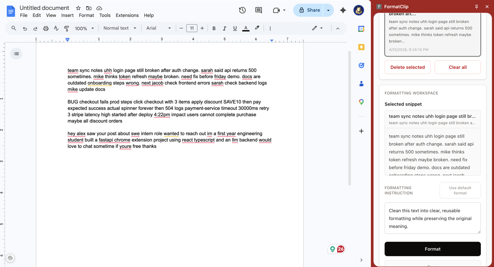

# FormatClip

[](https://github.com/Jakey794/formatclip/actions/workflows/ci.yml)
[](https://github.com/Jakey794/formatclip/actions/workflows/codeql.yml)
[](LICENSE)

FormatClip is a privacy-conscious Chrome Manifest V3 extension for saving text
snippets locally, formatting them on demand, and reusing the result from a
focused side-panel workflow.

It pairs a WXT, React, and TypeScript extension with a small FastAPI service.
Mock formatting works without an API key; optional OpenAI and Groq adapters use
the same typed response contract.



## Why FormatClip

Copied notes, emails, issue reports, logs, and resume text often need cleanup
before reuse. FormatClip provides a deliberate workflow without silently
monitoring the clipboard or reading webpages:

1. Add a snippet manually.
2. Select it and write a formatting instruction.
3. Click **Format** to send only that text to the configured local service.
4. Copy the result or replace the saved snippet.

## Highlights

- Chrome side panel with a single, responsive workflow
- Local persistence through `chrome.storage.local`
- Add, select, replace, delete, and clear snippet actions
- Typed FastAPI request and response schemas with input limits
- Mock, OpenAI, and Groq provider adapters
- Minimal extension permissions and local-only backend access by default
- Keyboard-visible focus states, live status announcements, and reduced-motion support
- Frontend and backend tests, dependency audits, CodeQL, and bundle budgets in CI

## Architecture

```text
Chrome side panel (WXT + React + TypeScript)
  ├─ manual snippet input
  ├─ chrome.storage.local
  └─ explicit POST /format
                 │
                 ▼
FastAPI service on 127.0.0.1:8000
  ├─ GET /health
  ├─ POST /format
  └─ mock | OpenAI | Groq provider
```

The repository intentionally has no Vercel deployment or public web frontend.
FormatClip is a browser extension backed by a local service, so website SEO
artifacts such as a sitemap, canonical URL, `robots.txt`, or `llms.txt` would not
describe a real public surface.

## Quick Start

Requirements:

- Python 3.11+
- Node.js 22+
- Chrome 114+

### 1. Start the backend

```bash
cd backend
python3 -m venv .venv
source .venv/bin/activate
python -m pip install --upgrade pip
python -m pip install -e ".[dev]"
python -m uvicorn app.main:app --reload
```

Confirm the service is running:

```bash
curl http://127.0.0.1:8000/health
```

### 2. Build the extension

```bash
cd extension
npm ci
npm run build
```

### 3. Load it in Chrome

1. Open `chrome://extensions`.
2. Enable **Developer mode**.
3. Select **Load unpacked**.
4. Choose `extension/.output/chrome-mv3`.
5. Click the FormatClip toolbar icon to open the side panel.

## Provider Configuration

Copy `.env.example` to `.env` or export the values in the shell that starts the
backend. Mock mode is the safe default and needs no API key:

```bash
FORMATCLIP_PROVIDER=mock
```

Optional OpenAI configuration:

```bash
FORMATCLIP_PROVIDER=openai
FORMATCLIP_MODEL=gpt-4.1-mini
OPENAI_API_KEY=your_key_here
```

Optional Groq configuration:

```bash
FORMATCLIP_PROVIDER=groq
FORMATCLIP_MODEL=llama-3.1-8b-instant
GROQ_API_KEY=your_key_here
```

Never commit a populated `.env` file. If a configured provider is unavailable,
the service logs the provider failure without logging snippet text and falls
back to the deterministic mock formatter.

## Privacy and Security

- Snippets stay in local extension storage.
- FormatClip does not monitor the clipboard or read the active webpage.
- Text leaves the extension only after the user clicks **Format**.
- The default backend address is loopback-only (`127.0.0.1:8000`).
- The manifest requests only `sidePanel`, `storage`, and the two local backend origins.
- API keys stay in the backend environment and are never bundled into the extension.
- No user accounts, analytics, database, or telemetry are included.

For unpacked development, the backend accepts valid Chrome extension origins.
For a fixed installed extension ID, set `FORMATCLIP_EXTENSION_ORIGINS` to an
exact comma-separated origin such as `chrome-extension://<extension-id>`.
See [SECURITY.md](SECURITY.md) for responsible disclosure.
See [PRIVACY.md](PRIVACY.md) for the complete data-handling statement.

## Development Checks

Backend:

```bash
cd backend
pytest
ruff check .
ruff format --check .
pip-audit
```

Extension:

```bash
cd extension
npm run format
npm run check
npm test
npm run build
npm run check:bundle
npm audit --audit-level=high
```

Production builds fail if JavaScript exceeds 225 kB, total code exceeds 245 kB,
or any source map is emitted.

## API

`GET /health` returns service status. `POST /format` accepts:

```json
{
  "text": "uhh meeting notes login broken; fix Friday; update docs",
  "instruction": "turn this into clean bullet points"
}
```

and returns:

```json
{
  "formatted_text": "- Meeting notes login broken\n- Fix Friday\n- Update docs",
  "detected_type": "notes",
  "changes_made": [
    "cleaned structure",
    "removed filler",
    "converted to bullets"
  ]
}
```

Interactive OpenAPI documentation is available locally at
`http://127.0.0.1:8000/docs` while the backend is running.

## Project Structure

```text
formatclip/
├── .github/        # CI, CodeQL, Dependabot, and contribution templates
├── backend/        # FastAPI service, providers, and pytest suite
├── docs/           # Demo and supporting project documentation
├── extension/      # WXT extension, React UI, tests, and icon assets
├── CHANGELOG.md
├── CONTRIBUTING.md
├── LICENSE
├── PRIVACY.md
└── SECURITY.md
```

## Project Status

Version 1.0 is a complete local-first portfolio release. Chrome Web Store
publishing and a hosted multi-user backend are intentionally out of scope; both
would require a separate privacy, abuse-prevention, authentication, and
operations design.

## Contributing

Issues and focused pull requests are welcome. Read [CONTRIBUTING.md](CONTRIBUTING.md)
before proposing a change.

## License

FormatClip is available under the [MIT License](LICENSE).
